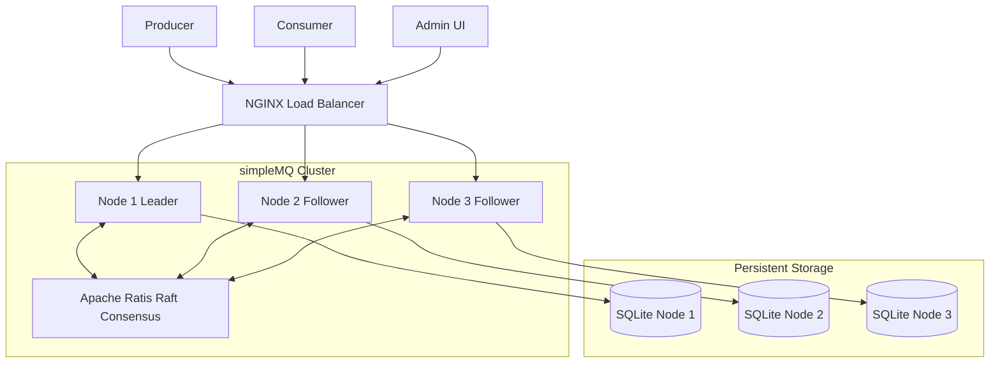
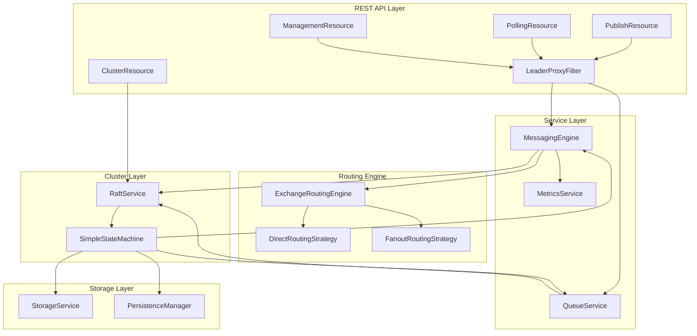
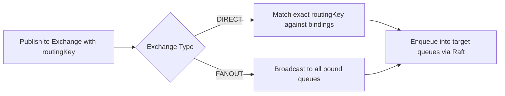
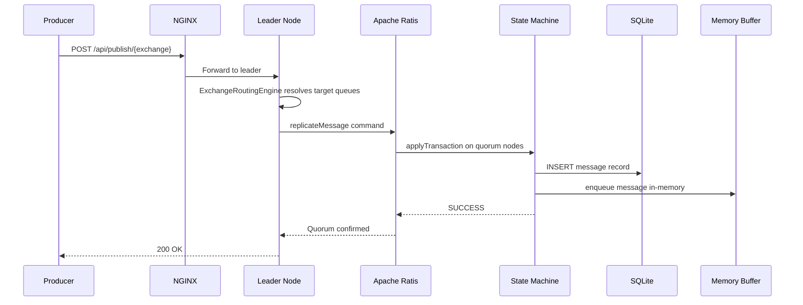
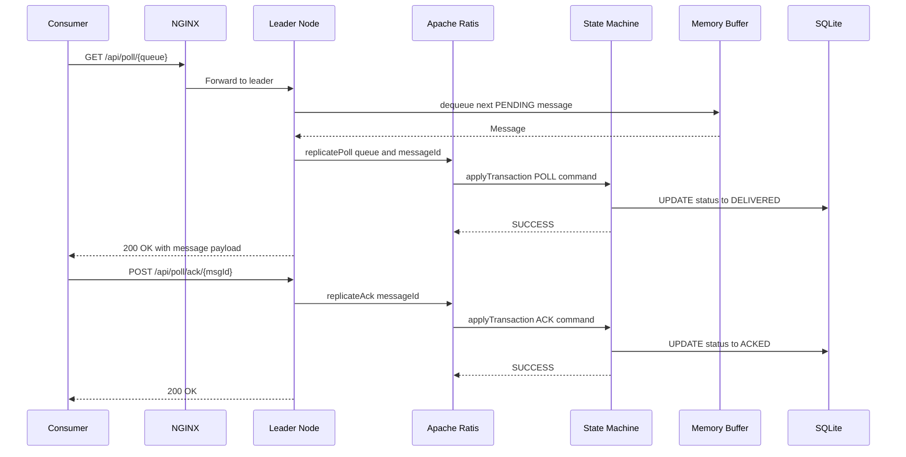
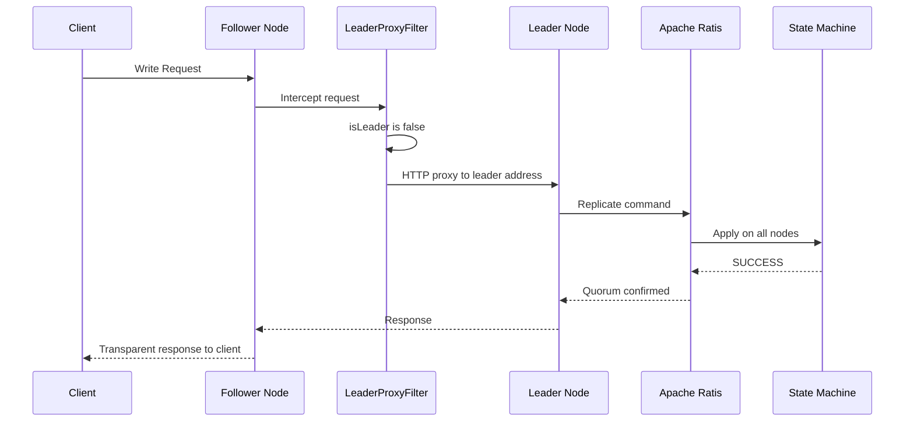
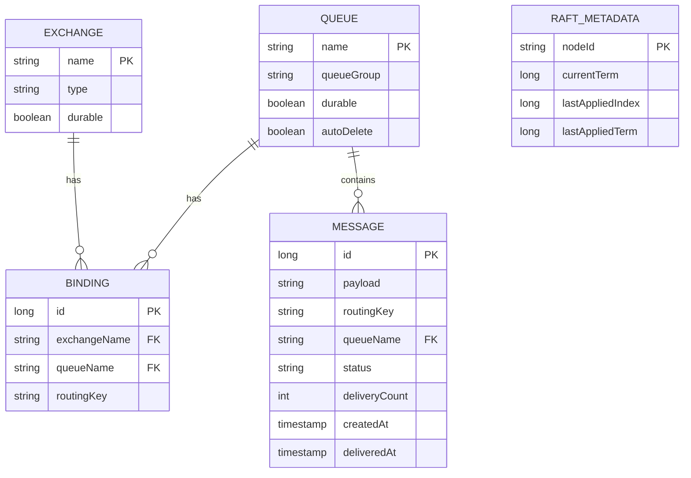
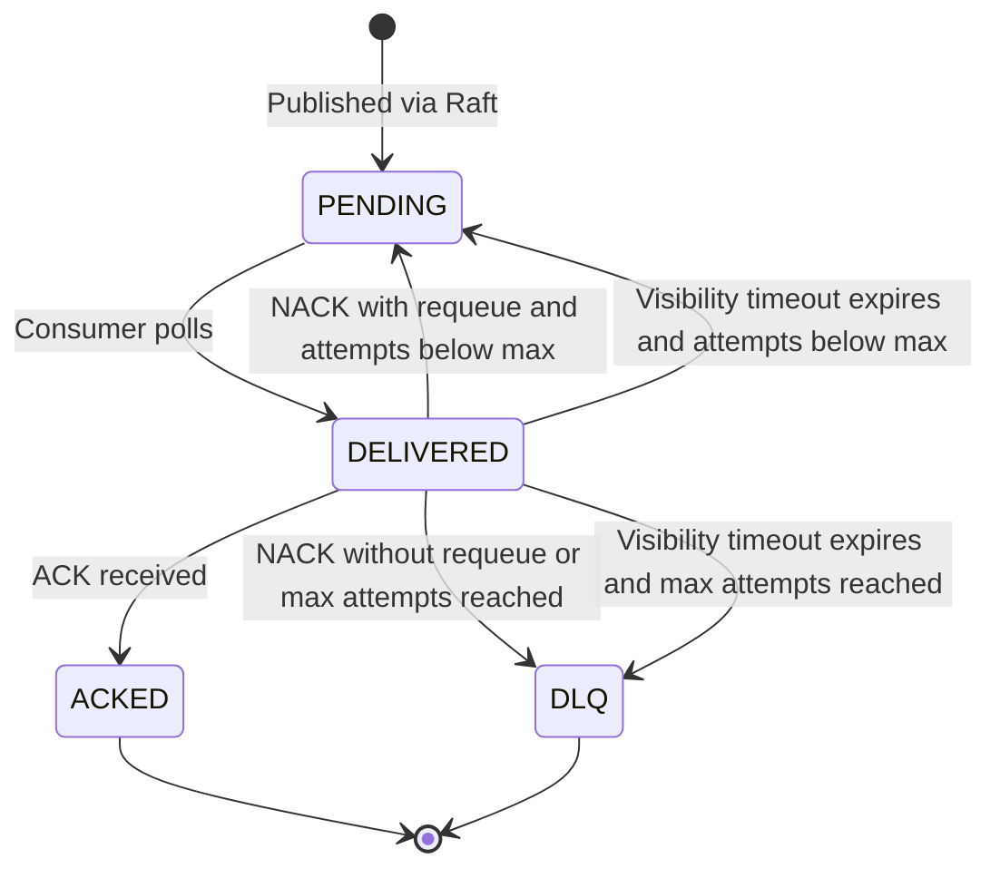
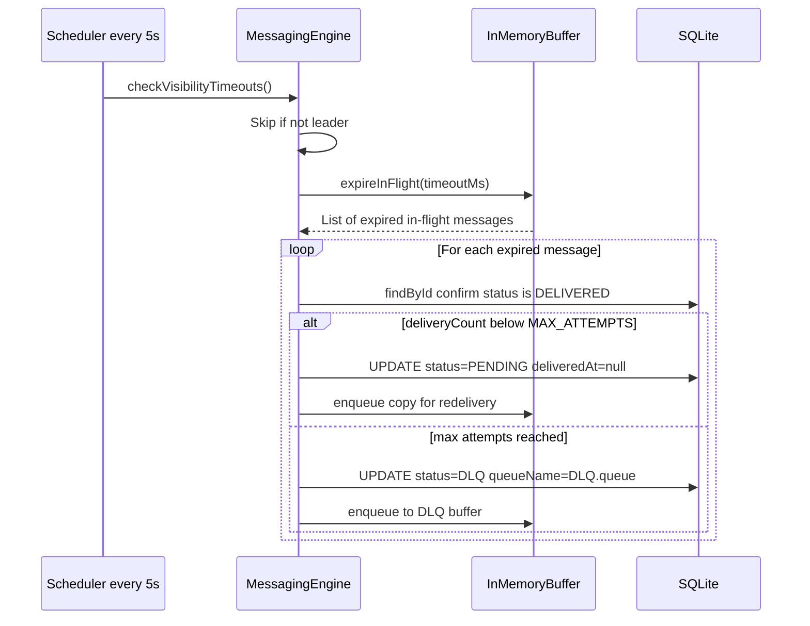

# simplemq - Simple Message Broker Design Plan

`simpleMQ` is a lightweight, distributed message broker built with Java 21 and the Quarkus framework. It is designed for high performance, durability, and high availability, featuring a hybrid storage model (in-memory + SQLite) and clustering powered by the Raft consensus algorithm.

## Architecture Overview

The system is built as a set of decoupled components working together to provide a robust messaging infrastructure:

1.  **REST API Layer (`io.dist.api`)**: The gateway for producers and consumers. It handles management (exchanges/queues), message publishing, and polling.
2.  **Messaging Engine (`io.dist.service`)**: The core logic that orchestrates message routing between exchanges and queues.
3.  **Clustering Service (`io.dist.cluster`)**: Implements the Raft consensus algorithm (via Apache Ratis) to ensure data consistency and leader election across a multi-node cluster.
4.  **Storage Engine (`io.dist.storage`)**: A hybrid model that keeps active messages in memory for speed while persisting them to a SQLite database for durability.
5.  **Routing Engine (`io.dist.routing`)**: Pluggable strategies for `Direct` (routing-key based) and `Fanout` (broadcast) message distribution.

## How It Works

### 1. Message Lifecycle
*   **Publishing**: A message is sent to an **Exchange**. The `MessagingEngine` determines which **Queues** it belongs to based on **Bindings** and the exchange's **Routing Strategy**.
*   **Replication**: Before a message is accepted, it is replicated to a quorum of nodes via the Raft protocol, ensuring it survives node failures.
*   **Consumption**: Consumers use a **Pull API** to retrieve messages from assigned queues.
*   **Acknowledgment**: Messages must be acknowledged (`ACK`) to be removed from the system. If a message fails (`NACK`) or times out, it is either retried or moved to a **Dead Letter Queue (DLQ)**.

### 2. High Availability & Clustering
*   **Leader Election**: Nodes automatically elect a leader using Raft. Only the leader handles write operations (publishing, queue creation).
*   **Transparent Proxying**: If a request hits a follower node, the `LeaderProxyFilter` automatically forwards it to the current leader. The client doesn't need to know who the leader is.
*   **State Consistency**: All metadata (exchanges, queues, bindings) and message states are replicated, so any node can take over if the leader fails.

## Features & Requirements

### Functional Requirements
- **Exchange & Queue Management**: Ability to create and delete exchanges and queues. Queues are assigned to specific groups.
- **Exchange Types**: Support for `Direct` (routing key based) and `Pub-Sub` (Fanout/Broadcast) exchange logic.
- **Producer API**: REST endpoint to publish messages to a specific exchange with a routing key.
- **Consumer API (Pull)**: REST endpoint for consumers to pull messages from assigned queues.
- **Acknowledgment System**: Mechanism to mark messages as 'done' (Ack) or 'failed' (Nack).
- **Dead Letter Queue (DLQ)**: Automated routing of messages to a DLQ after a specific number of failed attempts or a Nack.
- **Management UI**: A simple web-based dashboard to visualize and manage exchanges, queues, and message flow.

### Non-Functional Requirements
- **Hybrid Storage**: Messages must be handled in-memory for speed but persisted to disk using SQLite for durability.
- **High Availability**: Support for cluster mode with replication using Quorums.
- **Consensus & Election**: Implementation of the Raft algorithm for leader election and state consistency across the cluster.
- **Framework**: Developed using the Java Quarkus framework.
- **Quality Assurance**: Inclusion of Unit, Integration, and End-to-End (E2E) test cases.

## Cluster Management API

`simpleMQ` supports dynamic cluster membership and leader discovery via REST:

- **Leader Discovery**: `GET /api/cluster/leader`
  - Returns the ID of the current leader node.
- **List Peers**: `GET /api/cluster/peers`
  - Returns the list of all nodes currently in the cluster.
- **Join Cluster**: `POST /api/cluster/join?id=nodeX&address=host:port`
  - Adds a new node to the cluster. **Must be called on the current leader.**
- **Leave Cluster**: `POST /api/cluster/leave?id=nodeX`
  - Removes a node from the cluster. **Must be called on the current leader.**

#### High Availability & Load Balancing

`simpleMQ` now includes a transparent proxy mechanism and an optional Nginx load balancer to handle leader detection automatically.

- **Load Balancer (Nginx)**: http://localhost:8080
  - Distributes requests across all nodes in the cluster.
- **Transparent Proxy**: If a write request (Publish, Poll, Management) hits a follower node, it is automatically and transparently proxied to the current Raft leader.
- **State Replication**: All operations (Exchange/Queue creation, Publishing, Polling, Ack/Nack) are replicated via Raft to ensure cluster-wide consistency.

#### Running the Cluster

To start the 3-node cluster with the Nginx load balancer:

```bash
./gradlew build
docker-compose up --build
```

Nodes are available at:
- Load Balancer: http://localhost:8080
- Node 1: http://localhost:8081
- Node 2: http://localhost:8082
- Node 3: http://localhost:8083

#### Load Testing via Load Balancer

You can now run the load test against the load balancer:
```bash
BASE_URL=http://localhost:8080/api node load_test.js
```
The load balancer will distribute requests, and the nodes will internally ensure they reach the leader.

### Ephemeral Mode (Ignore saving files)

If you want to run `simpleMQ` without any persistent storage (e.g., for testing or if you are having issues with Docker volumes), you can use the **Ephemeral Mode**. This mode uses temporary directories for Raft logs and an in-memory database for SQLite.

To enable it, set the following environment variables:
- `SIMPLEMQ_PERSISTENCE_ENABLED=false`
- `QUARKUS_DATASOURCE_JDBC_URL=jdbc:sqlite::memory:`

When `SIMPLEMQ_PERSISTENCE_ENABLED` is `false`, the broker will:
1. Use a temporary directory for Raft logs that is automatically cleaned up on shutdown.
2. Skip message recovery from the database on startup.

Check the logs to see the leader election:
```bash
docker-compose logs -f | grep "LEADER"
```

### 6. Management UI
- [x] **Dashboard Development**: A comprehensive web-based management console to visualize and manage exchanges, queues, and message flow.
- [x] **API Integration**: Real-time integration with Management, Metrics, and Cluster REST APIs.
- [x] **Features**:
    - **Resource Management**: Create/Delete exchanges, queues, and bindings.
    - **Live Metrics**: Real-time stats for published, acked, nacked, and DLQ messages.
    - **Messaging Tools**: Built-in tools to publish messages and manually poll/ack messages from queues.
    - **Cluster Visualization**: View cluster nodes and manage membership (Join/Leave).

### 7. Testing & Quality Assurance
- [x] **Unit Testing**: Test routing logic and individual component behavior.
- [x] **Integration Testing**: Test API endpoints with an embedded SQLite database.
- [x] **E2E Testing**: Simulate a multi-node cluster to verify leader election and failover scenarios.

#### Load Testing Tool
A Node.js script `load_test.js` is provided to simulate producer and consumer activity.

To run the load test:
```bash
# Default (localhost:8080)
node load_test.js

# For Docker Compose cluster (Node 1)
BASE_URL=http://localhost:8081/api node load_test.js
```

Options:
- `BASE_URL`: The API base URL (default: `http://localhost:8080/api`).
- `MODE`: `all`, `producer`, `consumer`, or `setup` (default: `all`).
- `DELAY`: Delay between producer messages in ms (default: `1000`).

---

## High-Level Design (HLD)

### System Context

simpleMQ operates as a clustered message broker with three layers: a client-facing NGINX load balancer (`:8080`), a distributed 3-node broker cluster (`:8081–8083`), and a per-node SQLite storage layer. Raft consensus runs on a separate gRPC channel (`:9851–9853`).



### Component Architecture

Each node is a full Quarkus application composed of five internal layers. All write requests pass through the `LeaderProxyFilter` before reaching business logic.



---

## Low-Level Design (LLD)

### Message Routing Model

A message is published to an **Exchange** with a routing key. The exchange type determines which bound queues receive it.



### Message Publish Flow



### Message Consume and Acknowledgment Flow



### Leader Proxy and Transparent Failover

Write requests hitting a follower are automatically intercepted and forwarded to the current leader. The client receives the response transparently.



### Data Model



### Message Lifecycle State Machine

Messages pass through a defined set of states from publish to final resolution. A NACK or an expired visibility timeout re-enqueues the message up to 3 delivery attempts before routing it to a Dead Letter Queue (`DLQ.<queue_name>`).



### Visibility Timeout and Automatic Redelivery

If a consumer polls a message but never sends ACK or NACK (e.g. crashes or stalls), the message would be lost without this mechanism. The leader runs a scheduler every 5 seconds that inspects all in-flight messages and requeues any that have exceeded the visibility timeout (default 30 seconds, configurable via `simplemq.visibility.timeout-ms`).


